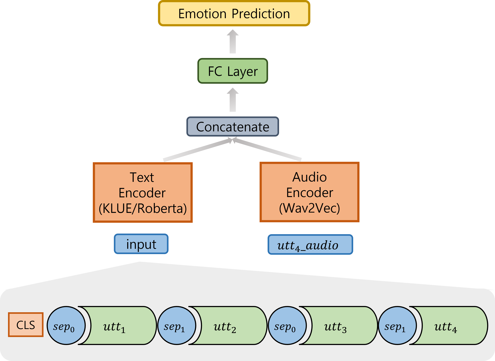

# CoKoME: Context Modeling for Korean Multimodal Emotion Recognition in Conversation

The overall flow of our model

---
## Requirement

Key Libraries
1. torch 1.13.1
2. transformers 4.27.2
4. librosa 0.10.0 

More Detail: ETRI/requirements.txt


## Datasets


[KEMDy20](https://nanum.etri.re.kr/share/kjnoh/KEMDy20?lang=ko_KR)


## Train & Run
### CoKoME
```bash
cd ..
python3 ETRI/CoKoME/Main.py
```
### Text Only
```bash
cd ..
python3 ETRI/utterance_text/Main.py
```
### Audio Only
```bash
cd ..
python3 ETRI/utterance_audio/Main.py
```
### Single Text with Audio
```bash
cd ..
python3 ETRI/utterance_fusion/Main.py
```